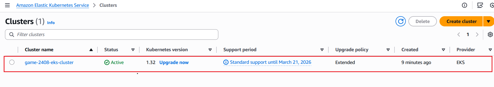
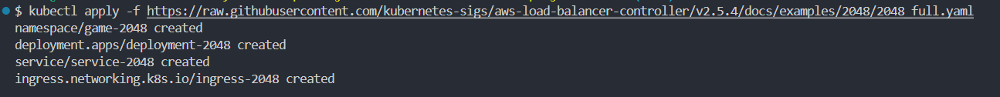
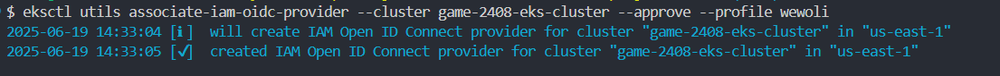
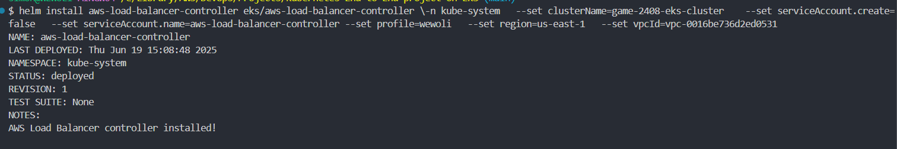
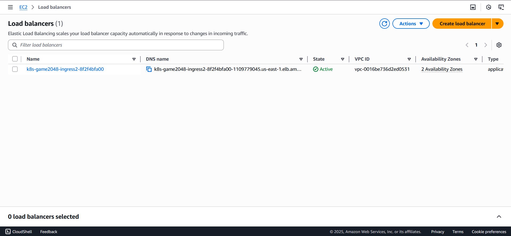
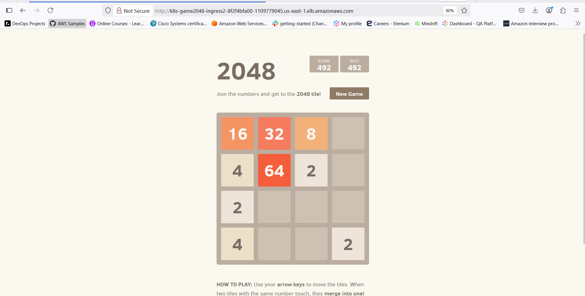

# Kubernetes End-to-End project on EKS: AWS EKS Cluster Setup, Application Deployment, and Ingress Configuration

## Introduction 
Kubernetes is an open-source container orchestration platform that enables you to automate the  deployment,sacaling and  management containerised applications at scale. Kubernetes offers a lot of benefits including:
1. Auto-healing
2. Auto-scaling
3. Enterprise-support
More on Kubernetes [here](https://kubernetes.io/)

With all these benefits comes the complexity of managing Kubernetes clusters. This is where Amazon Elastic Kubernetes Service (EKS) comes into the picture. EKS provides a fully managed Kubernetes service that eliminates the complexity of operating Kubernetes clusters. EKS allows you to:
1. Deploy applications faster with less operational overhead
2. Scale seamlessly to meet changing workload demands
3. Improve security through AWS integration and automated updates
4. Choose between standard EKS or fully automated EKS Auto Mode
For further reading, you can access the [EKS official documentation](https://docs.aws.amazon.com/eks/latest/userguide/what-is-eks.html)

In this project, we will be creating an EKS cluster in AWS and deploying an application to that cluster. So grab a cup of coffee and let’s get started. 

## Prerequisites
**1. AWS Account:** You should have an AWS account with an IAM user with these minimal access levels. 
| AWS Service | Access Level | Details |
|-------------|--------------|---------|
| CloudFormation | Full Access | - |
| EC2 | **Full:** Tagging<br>**Limited:** List, Read, Write | Full access for tagging operations, limited access for list, read, and write operations |
| EC2 Auto Scaling | **Limited:** List, Write | Limited access for list and write operations |
| EKS | Full Access | - |
| IAM | **Limited:** List, Read, Write, Permissions Management | Limited access for list, read, write, and permissions management operations |
| Systems Manager | **Limited:** List, Read | Limited access for list and read operations |

**2. AWS CLI** installed and configure AWS CLI
   - Download from [Installing or updating to the latest version of the AWS CLI](https://docs.aws.amazon.com/cli/latest/userguide/getting-started-install.html)

**3.kubectl** installed kubectl for cluster management from the official Kubernetes page
   - Download from [Install Tools](https://kubernetes.io/docs/tasks/tools/install-kubectl/)

**4.eksctl** installed  eksctl CLI  used to work with EKS clusterswith ease.
   - Download from [Installation](https://eksctl.io/installation/)

**5 Knowledge and Understanding of AWS and Kubernetes** You should have some basic knowledge and skills of working with AWS, espercially AWS CLL and Kubernetes.
   

## Tech Stack/ AWS Services
- 1. VPC
- 2. Subnets
- 3. IAM Roles
- 4. Route TAbles
- 5. NatGateway
- 6. Security Groups
- 7. Internete Gateway
- 9. EKS Cluster
- 10. Elastic IP (EIP)


## EKS Cluster  Setup 

### Create EKS Cluster


Use the eksctl tool to create your kubernetes cluster in AWS.

```bash
  eksctl create cluster --name <CLUSTER_NAME> --profile <AWS_PROFILE> --region <AWS_REGION> --fargate
```
- **CLUSTER_NAME:** Name of your cluster eg. game-2408-eks-cluster
- **AWS_REGION:** The region to deploy your cluster eg. us-east-1
- **AWS_PROFILE:**  AWS profile to use, if you don't specify a profile the default profile will be used.

When you run the above command, it will creates a new Amazon EKS  cluster using AWS Fargate compute type. With Fargate , AWS manages the underlying compute infrastructure for you in the data plane. 

**NOTE** Don't forget to replace the **CLUSTER_NAME:** , **AWS_PROFILE:** and **AWS_REGION:** with your prefered values. In this project i will use game-2408-eks-cluster and us-east-1 for cluster name and region respectively. When you don't specify a profile the default profile will be used.

**game-2408-eks-cluster creation**


**game-2408-eks-cluster**


Deleting EKS cluster
```bash
  eksctl delete cluster --name demo-cluster --region us-east-1
```
you can use the above command to delete your EKS cluster.  Make sure to delete your cluster after you have completed the project so that you will not incure additional charges

### Download the kube config file

```bash
aws eks update-kubeconfig --name <CLUSTER_NAME> --profile <AWS_PROFILE> --region <REGION>
```
This command adds or updates the configuration in your ~/.kube/config file so you can use kubectl commands to manage the your  EKS cluster


**CLUSTER_NAME:** Name of your cluster eg. game-2408-eks-cluster
**AWS_REGION:** The region to deploy your cluster eg. us-east-1
**AWS_PROFILE:**  AWS profile to use, if you don't specify a profile the default profile will be used.

```bash
aws eks update-kubeconfig --name game-2408-eks-cluster --profile wewoli --region us-east-1
```


## Deploy application to EKS Cluster 

### Create Fargate profile
In this next step you need to create a fargte profile. The `eksctl create fargateprofile` command  creates a Fargate profile that enables your EKS cluster to run pods on AWS Fargate serverless compute. It sets up a profile, `alb-sample-app` that will automatically schedule any pods created in the `game-2048` namespace to run on Fargate
```bash
eksctl create fargateprofile \
    --cluster <CLUSTER_NAME> \
    --region <REGION> \
    --name alb-sample-app \
    --namespace game-2048 \
    --profile <AWS_PROFILE>
```
Make sure to replace the `<CLUSTER_NAME`,`<REGION>`  and `<AWS_PROFILE>` with the necessory values.

**Fagate Profile creation**


**Fagate Profile**


### Deploy the deployment, service and Ingress resources
Now that your cluster is all setup , deploy your application and all the necessory resources that your application needs.

```bash
kubectl apply -f https://raw.githubusercontent.com/kubernetes-sigs/aws-load-balancer-controller/v2.5.4/docs/examples/2048/2048_full.yaml
```


### Check that the all the resources have been created successfully
**Pods**
Command
```bash
kubectl get pods -n game-2048
```
Output
```bash
NAME                              READY   STATUS    RESTARTS   AGE
deployment-2048-bdbddc878-5r6pp   1/1     Running   0          12m
deployment-2048-bdbddc878-gn8jd   1/1     Running   0          12m
deployment-2048-bdbddc878-rg7xb   1/1     Running   0          12m
deployment-2048-bdbddc878-wb57x   1/1     Running   0          12m
deployment-2048-bdbddc878-z7spf   1/1     Running   0          12m
```

**Service**
Command
```bash
kubectl get svc -n game-2048
```
Output
```bash
NAME           TYPE       CLUSTER-IP     EXTERNAL-IP   PORT(S)        AGE
service-2048   NodePort   10.100.20.30   <none>        80:31923/TCP   12m
```
**Deployment**
Command
```bash
kubectl get deply -n game-2048
```
Output
```bash
NAME              READY   UP-TO-DATE   AVAILABLE   AGE
deployment-2048   5/5     5            5           13m

```
**Ingress**
Command
```bash
kubectl get ingress -n game-2048
```
Output
```bash
NAME           CLASS   HOSTS   ADDRESS   PORTS   AGE
ingress-2048   alb     *                 80      12m
```
OR alternatively you get all the resources with one command

**Get all resources in the game-2048 Namespace**
Command
```bash
kubectl get all -n game-2048
```
Output
```bash
NAME                                  READY   STATUS    RESTARTS   AGE
pod/deployment-2048-bdbddc878-5r6pp   1/1     Running   0          13m
pod/deployment-2048-bdbddc878-gn8jd   1/1     Running   0          13m
pod/deployment-2048-bdbddc878-rg7xb   1/1     Running   0          13m
pod/deployment-2048-bdbddc878-wb57x   1/1     Running   0          13m
pod/deployment-2048-bdbddc878-z7spf   1/1     Running   0          13m

NAME                   TYPE       CLUSTER-IP     EXTERNAL-IP   PORT(S)        AGE
service/service-2048   NodePort   10.100.20.30   <none>        80:31923/TCP   13m

NAME                              READY   UP-TO-DATE   AVAILABLE   AGE
deployment.apps/deployment-2048   5/5     5            5           13m

NAME                                        DESIRED   CURRENT   READY   AGE
replicaset.apps/deployment-2048-bdbddc878   5         5         5       13m
```


## Setup ALB add on

### configure IAM OIDC provider
```bash
eksctl utils associate-iam-oidc-provider --cluster game-2408-eks-cluster --approve
``` 
This command allows the  pods running in your EKS cluster to assume AWS IAM roles directly, without needing to store AWS credentials in the pods or use EC2 instance profiles


### Create IAM role
Download IAM policy
```bash
curl -O https://raw.githubusercontent.com/kubernetes-sigs/aws-load-balancer-controller/v2.11.0/docs/install/iam_policy.json
```
Create IAM Policy

```bash
eksctl utils associate-iam-oidc-provider --cluster game-2408-eks-cluster --approve
```
Create IAM Role

```bash
eksctl create iamserviceaccount \
  --cluster=<your-cluster-name> \
  --namespace=kube-system \
  --name=aws-load-balancer-controller \
  --role-name AmazonEKSLoadBalancerControllerRole \
  --attach-policy-arn=arn:aws:iam::<your-aws-account-id>:policy/AWSLoadBalancerControllerIAMPolicy \
  --approve
```


### Deploy ALB controller using Helm charts
**Add helm repo**
```bash
    helm repo add eks https://aws.github.io/eks-charts
```
**Update the repo**
```bash
    helm repo update eks
```
**Install helm chat**
```bash
helm install aws-load-balancer-controller eks/aws-load-balancer-controller \         
  -n kube-system \
  --set clusterName=game-2408-eks-cluster  \
  --set serviceAccount.create=false \
  --set serviceAccount.name=aws-load-balancer-controller \
  --set region=us-east-1 \
  --set vpcId=<VPC_ID> \
  --set profile=wewoli
```
**ALB controller Creation**


**ALB created in AWS**


**Verify that the deployments are running.**
```bash
kubectl get deployment -n kube-system aws-load-balancer-controller
```
**Access the application using the DNS of the ALB**


## ERRORS Debugging and Troubleshooting

### 1.Error: validation for 2408_game_eks_cluster failed
Error: validation for 2408_game_eks_cluster failed, name must satisfy regular expression pattern: [a-zA-Z][-a-zA-Z0-9]*

Solution: rename the cluster to follow the proper naming convertion

### 2. Error: failed to create iamserviceaccount(s)
Error: failed to create iamserviceaccount(s)
2025-06-19 15:40:22 [ℹ]  1 error(s) occurred and IAM Role stacks haven't been created properly, you may wish to check CloudFormation console
2025-06-19 15:40:22 [✖]  waiter state transitioned to Failure

Solution:
Check and make sure the IAM policy and role are created in the same AWS accout you deployed your EKS custer


  